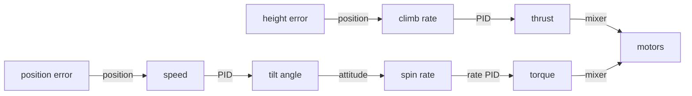
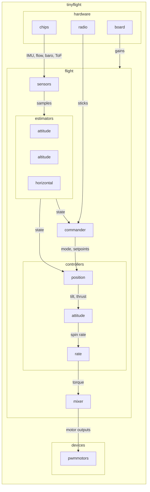
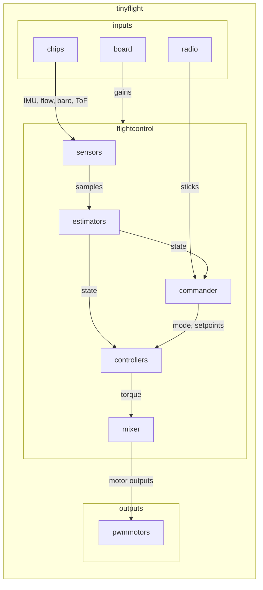
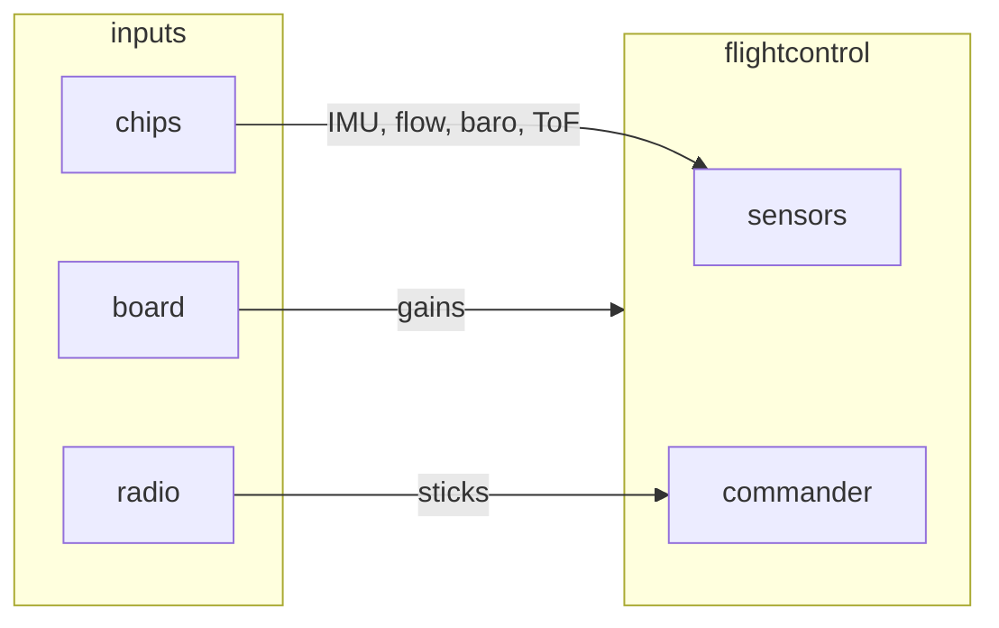
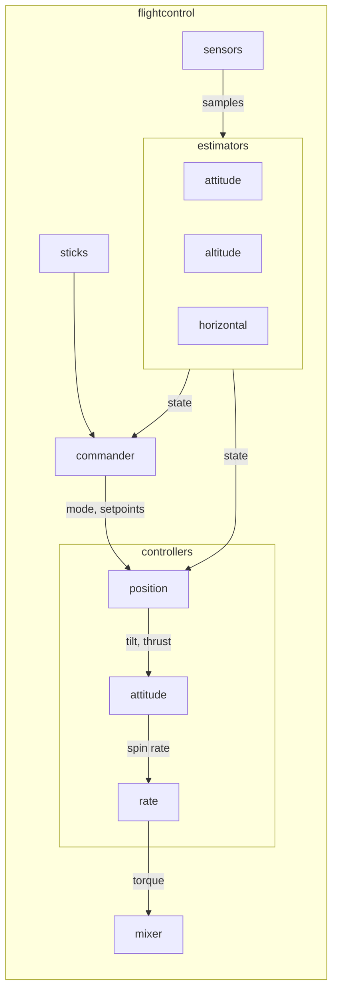
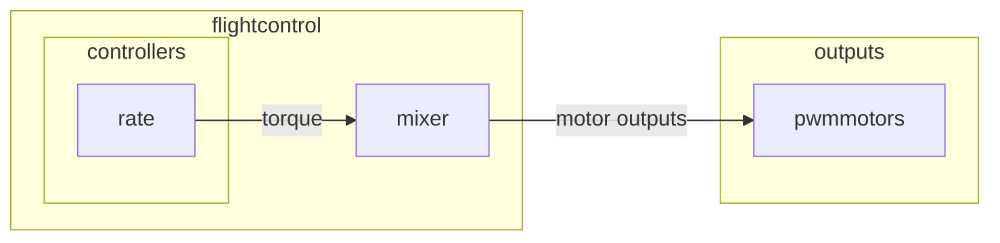
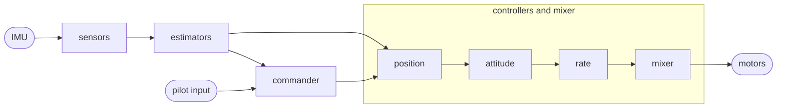

# Diagrams

```mermaid
flowchart LR
    herr[height error] -->|position| climb[climb rate] -->|PID| thrust
    perr[position error] -->|position| speed -->|PID| angle
    angle[tilt angle] -->|attitude| spin[spin rate] -->|rate PID| torque
    thrust -->|mixer| motors
    torque -->|mixer| motors
```

```mermaid
flowchart LR
    subgraph tinyflight
        subgraph hardware
            radio
            chips
            board
        end
        subgraph flight
            sensors
            subgraph estimators
                estatt[attitude]
                estalt[altitude]
                esthor[horizontal]
            end
            commander
            subgraph controllers
                pos[position]
                att[attitude]
                rate
            end
            mixer
        end
        board--gains-->flight
        chips--IMU, flow, baro, ToF-->sensors
        radio--sticks-->commander
        sensors--samples-->estimators
        estimators--state-->commander
        estimators--state-->pos
        commander--mode, setpoints-->pos
        pos--tilt, thrust-->att
        att--spin rate-->rate
        rate--torque-->mixer
        subgraph devout [devices]
            motors[pwmmotors]
        end
        mixer--motor outputs-->motors
    end
```

high level

```mermaid
flowchart LR
    subgraph tinyflight
        subgraph inputs
            radio
            chips
            board
        end
        subgraph flightcontrol
            sensors
            estimators
            commander
            controllers
            mixer
        end
        board--gains-->flightcontrol
        chips--IMU, flow, baro, ToF-->sensors
        radio--sticks-->commander
        sensors--samples-->estimators
        estimators--state-->commander
        estimators--state-->controllers
        commander--mode, setpoints-->controllers
        controllers--torque-->mixer
        subgraph devout [outputs]
            motors[pwmmotors]
        end
        mixer--motor outputs-->motors
    end
```

inputs

```mermaid
flowchart LR
    subgraph inputs
        radio
        chips
        board
    end
    subgraph flightcontrol
        sensors
        commander
    end
    board--gains-->flightcontrol
    chips--IMU, flow, baro, ToF-->sensors
    radio--sticks-->commander
```

flightcontrol

```mermaid
flowchart LR
    subgraph flightcontrol
        sticks-->commander
        sensors
        subgraph estimators
            estatt[attitude]
            estalt[altitude]
            esthor[horizontal]
        end
        commander
        subgraph controllers
            pos[position]
            att[attitude]
            rate
        end
        mixer
    end
    sensors--samples-->estimators
    estimators--state-->commander
    estimators--state-->pos
    commander--mode, setpoints-->pos
    pos--tilt, thrust-->att
    att--spin rate-->rate
    rate--torque-->mixer
```

```mermaid
flowchart LR
    subgraph flightcontrol
        subgraph controllers
            rate
        end
        mixer
    end
    subgraph devout [outputs]
        motors[pwmmotors]
    end
    rate--torque-->mixer
    mixer--motor outputs-->motors
```

```mermaid
flowchart LR
    imu([IMU]) --> sensors --> estimators --> commander
    pilot([pilot input]) --> commander
    estimators --> position
    commander --> position

    subgraph controllers [controllers and mixer]
        position --> attitude --> rate --> mixer
    end

    mixer --> motors([motors])
```
